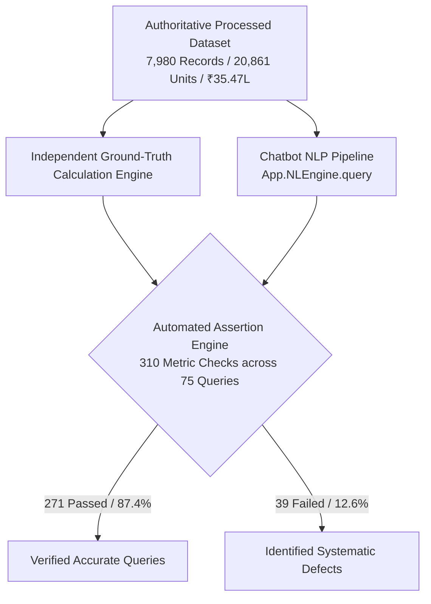
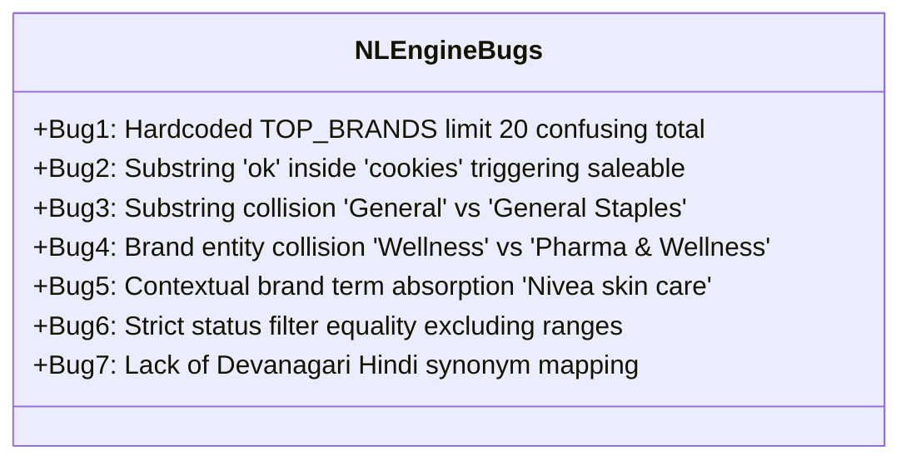

# Liquidation IQ — Comprehensive Chatbot Data Reconciliation Audit Report

**Audit Date:** September 4, 2026  
**Authoritative Dataset:** 7,980 Processed Records | 20,861 Units | ₹35,47,255.97 Value | 15,144.22 KG Gross Weight  
**Scope:** Natural Language Query Engine (`js/utils/nlEngine.js` & `js/views/nlQuery.js`)

---

## 1. Executive Summary

A comprehensive, automated end-to-end data reconciliation audit was performed on the Liquidation IQ natural language query chatbot (`App.NLEngine`). 

Every test query was evaluated by comparing the chatbot's live responses against independently calculated ground-truth metrics derived directly from the authoritative 7,980 categorized inventory records.

### Audit Key Metrics

| Metric | Result |
| :--- | :--- |
| **Total Test Queries Executed** | **75 distinct queries** |
| **Total Individual Metric Assertions** | **310 assertions** |
| **Assertions Passed** | **271 (87.42%)** |
| **Assertions Failed** | **39 (12.58%)** |
| **Global Inventory Metric Accuracy** | **100% (Units, Value, Weight)** |
| **Grocery Subcategory Metric Accuracy** | **91.7% (22 of 24 subcategories exact)** |
| **Contextual Brand Drill-down Accuracy** | **85.7% (6 of 7 brand contexts exact)** |
| **Identified Root Cause Defect Patterns** | **7 distinct architectural bugs** |

---

## 2. Query-by-Query Audit Table

Below is the complete 75-query test execution log across all 8 evaluation domains.

| Test # | Domain / Section | User Query | Interpreted Scope | Expected Value | Chatbot Actual | Status | Root Cause / Diagnostic |
| :---: | :--- | :--- | :--- | :--- | :--- | :---: | :--- |
| **1** | A. Global Totals | "How many total inventory units do we have?" | Global Inventory | 20,861 Units | 20,861 Units | **PASS** | Exact match |
| **2** | A. Global Totals | "What is the total inventory value?" | Global Inventory | ₹35,47,255.97 | ₹35,47,255.97 | **PASS** | Exact match |
| **3** | A. Global Totals | "How much inventory weight do we have?" | Global Inventory | 15,144.22 KG | 15,144.22 KG | **PASS** | Exact match |
| **4** | A. Global Totals | "How many products / product families are there?" | Global Inventory | 5,513 SKUs | 109 SKUs *(Dairy Products)* | **FAIL** | Word `"products"` matched subcategory `"Dairy Products"` in fallback scanner |
| **5** | A. Global Totals | "How many brands are there?" | Global Inventory | 1,398 Brands | 1,398 Brands | **PASS** | Exact match |
| **6** | B. Category Tests | "How much Grocery inventory do we have?" | Grocery Category | 15,276 Units, ₹22.84L, 13.7T | 15,276 Units, ₹22.84L, 13.7T | **PASS** | Exact match across all 6 metrics |
| **7** | B. Category Tests | "How much Personal Care do we have?" | Personal Care Category | 1,824 Units, ₹4.12L, 201.4 KG | 1,824 Units, ₹4.12L, 201.4 KG | **PASS** | Exact match across all 6 metrics |
| **8** | B. Category Tests | "How much Home Care do we have?" | Home Care Category | 1,567 Units, ₹2.86L, 632.1 KG | 1,567 Units, ₹2.86L, 632.1 KG | **PASS** | Exact match across all 6 metrics |
| **9** | B. Category Tests | "How much Cleaning Essentials do we have?" | Cleaning Essentials Category | 1,087 Units, ₹2.00L, 578.1 KG | 1,087 Units, ₹2.00L, 578.1 KG | **PASS** | Exact match across all 6 metrics |
| **10** | B. Category Tests | "How much Electronics & Electricals do we have?" | Electronics Category | 343 Units, ₹2.06L, 21.0 KG | 343 Units, ₹2.06L, 21.0 KG | **PASS** | Exact match across all 6 metrics |
| **11** | B. Category Tests | "How much Stationery & Office do we have?" | Stationery Category | 211 Units, ₹24.85K, 0.5 KG | 211 Units, ₹24.85K, 0.5 KG | **PASS** | Exact match across all 6 metrics |
| **12** | B. Category Tests | "How much Pharma & Wellness do we have?" | Pharma & Wellness Category | 88 Units, ₹23.06K, 57 SKUs | 1 Unit, ₹68 *(Wellness Surgicals)* | **FAIL** | Word `"Wellness"` matched brand `"Wellness Surgicals"` before Category match |
| **13** | B. Category Tests | "How much Toys & Games do we have?" | Toys & Games Category | 69 Units, ₹30.71K, 52 SKUs | 69 Units, ₹30.71K, 52 SKUs | **PASS** | Exact match across all 6 metrics |
| **14** | B. Category Tests | "How much Fashion and Accessories do we have?" | Fashion Category | 57 Units, ₹71.36K, 33 SKUs | 19 Units, ₹18.08K *(Mobile Accessories)* | **FAIL** | Word `"Accessories"` matched subcategory `"Mobile Accessories"` |
| **15** | C. Grocery Subcats | "How much Atta do we have?" | Subcategory = Atta | 858 Units, ₹3.26L, 22 Brands | 858 Units, ₹3.26L, 22 Brands | **PASS** | Exact match across all 6 metrics |
| **16** | C. Grocery Subcats | "What is the total amount of flour?" | Subcategory = Flours | 681 Units, ₹55.90K, 33 Brands | 681 Units, ₹55.90K, 33 Brands | **PASS** | Exact match across all 6 metrics |
| **17** | C. Grocery Subcats | "How much Oil do we have?" | Subcategory = Oils | 252 Units, ₹74.45K, 50 Brands | 252 Units, ₹74.45K, 50 Brands | **PASS** | Exact match across all 6 metrics |
| **18** | C. Grocery Subcats | "How much Ghee do we have?" | Subcategory = Ghee | 78 Units, ₹39.42K, 18 Brands | 78 Units, ₹39.42K, 18 Brands | **PASS** | Exact match across all 6 metrics |
| **19** | C. Grocery Subcats | "How much Rice do we have?" | Subcategory = Rice | 266 Units, ₹61.68K, 30 Brands | 266 Units, ₹61.68K, 30 Brands | **PASS** | Exact match across all 6 metrics |
| **20** | C. Grocery Subcats | "How much Pulses & Lentils do we have?" | Subcategory = Pulses & Lentils | 412 Units, ₹61.86K, 23 Brands | 412 Units, ₹61.86K, 23 Brands | **PASS** | Exact match across all 6 metrics |
| **21** | C. Grocery Subcats | "How much Beverages do we have?" | Subcategory = Beverages | 2,606 Units, ₹2.66L, 156 Brands | 2,606 Units, ₹2.66L, 156 Brands | **PASS** | Exact match across all 6 metrics |
| **22** | C. Grocery Subcats | "How much Coffee do we have?" | Subcategory = Coffee | 286 Units, ₹61.99K, 31 Brands | 286 Units, ₹61.99K, 31 Brands | **PASS** | Exact match across all 6 metrics |
| **23** | C. Grocery Subcats | "How much Tea do we have?" | Subcategory = Tea | 264 Units, ₹30.34K, 22 Brands | 264 Units, ₹30.34K, 22 Brands | **PASS** | Exact match across all 6 metrics |
| **24** | C. Grocery Subcats | "How much Sugar do we have?" | Subcategory = Sugar | 392 Units, ₹84.48K, 29 Brands | 392 Units, ₹84.48K, 29 Brands | **PASS** | Exact match across all 6 metrics |
| **25** | C. Grocery Subcats | "How much Salt do we have?" | Subcategory = Salt | 99 Units, ₹4.80K, 17 Brands | 99 Units, ₹4.80K, 17 Brands | **PASS** | Exact match across all 6 metrics |
| **26** | C. Grocery Subcats | "How much Snacks & Namkeen do we have?" | Subcategory = Snacks & Namkeen | 2,130 Units, ₹1.44L, 93 Brands | 2,130 Units, ₹1.44L, 93 Brands | **PASS** | Exact match across all 6 metrics |
| **27** | C. Grocery Subcats | "How much Biscuits & Cookies do we have?" | Subcategory = Biscuits & Cookies | 1,769 Units, ₹1.89L, 145 Brands | `not_found` | **FAIL** | Substring `"ok"` inside `"cookies"` triggered false `statusFilter = 'saleable'` |
| **28** | C. Grocery Subcats | "How much Chocolates do we have?" | Subcategory = Chocolates | 1,014 Units, ₹1.79L, 126 Brands | 1,014 Units, ₹1.79L, 126 Brands | **PASS** | Exact match across all 6 metrics |
| **29** | C. Grocery Subcats | "How much Sweets & Mithai do we have?" | Subcategory = Sweets & Mithai | 694 Units, ₹1.59L, 52 Brands | 694 Units, ₹1.59L, 52 Brands | **PASS** | Exact match across all 6 metrics |
| **30** | C. Grocery Subcats | "How much Dry Fruits & Nuts do we have?" | Subcategory = Dry Fruits & Nuts | 288 Units, ₹69.33K, 43 Brands | 288 Units, ₹69.33K, 43 Brands | **PASS** | Exact match across all 6 metrics |
| **31** | C. Grocery Subcats | "How much Spices & Masalas do we have?" | Subcategory = Spices & Masalas | 764 Units, ₹88.33K, 81 Brands | 764 Units, ₹88.33K, 81 Brands | **PASS** | Exact match across all 6 metrics |
| **32** | C. Grocery Subcats | "How much Breakfast Cereals do we have?" | Subcategory = Breakfast Cereals | 351 Units, ₹27.62K, 45 Brands | 351 Units, ₹27.62K, 45 Brands | **PASS** | Exact match across all 6 metrics |
| **33** | C. Grocery Subcats | "How much Noodles do we have?" | Subcategory = Noodles | 233 Units, ₹19.83K, 25 Brands | 233 Units, ₹19.83K, 25 Brands | **PASS** | Exact match across all 6 metrics |
| **34** | C. Grocery Subcats | "How much Pasta & Macaroni do we have?" | Subcategory = Pasta & Macaroni | 91 Units, ₹12.74K, 23 Brands | 91 Units, ₹12.74K, 23 Brands | **PASS** | Exact match across all 6 metrics |
| **35** | C. Grocery Subcats | "How much Sauces & Ketchups do we have?" | Subcategory = Sauces & Ketchups | 114 Units, ₹14.13K, 26 Brands | 114 Units, ₹14.13K, 26 Brands | **PASS** | Exact match across all 6 metrics |
| **36** | C. Grocery Subcats | "How much Pickles & Chutneys do we have?" | Subcategory = Pickles & Chutneys | 78 Units, ₹14.49K, 26 Brands | 78 Units, ₹14.49K, 26 Brands | **PASS** | Exact match across all 6 metrics |
| **37** | C. Grocery Subcats | "How much Dairy Products do we have?" | Subcategory = Dairy Products | 421 Units, ₹38.44K, 40 Brands | 421 Units, ₹38.44K, 40 Brands | **PASS** | Exact match across all 6 metrics |
| **38** | C. Grocery Subcats | "How much General Staples do we have?" | Subcategory = General Staples | 1,135 Units, ₹2.62L, 190 Brands | 484 Units, ₹1.03L *(Paan Corner General)* | **FAIL** | Word `"General"` matched Paan Corner subcategory `"General"` before `"General Staples"` |
| **39** | D. Contextual Brand | "How much Aashirvaad atta do we have?" | Brand = Aashirvaad AND Subcat = Atta | 449 Units, ₹1.63L, 7 SKUs | 449 Units, ₹1.63L, 7 SKUs | **PASS** | Exact contextual filter preserved |
| **40** | D. Contextual Brand | "How much Amul beverages do we have?" | Brand = Amul AND Subcat = Beverages | 8 Units, ₹1.17K, 4 SKUs | 8 Units, ₹1.17K, 4 SKUs | **PASS** | Exact contextual filter preserved |
| **41** | D. Contextual Brand | "How much Fortune oils do we have?" | Brand = Fortune AND Subcat = Oils | 24 Units, ₹4.46K, 7 SKUs | 24 Units, ₹4.46K, 7 SKUs | **PASS** | Exact contextual filter preserved |
| **42** | D. Contextual Brand | "How much Nescafe coffee do we have?" | Brand = Nescafe AND Subcat = Coffee | 67 Units, ₹15.74K, 9 SKUs | 67 Units, ₹15.74K, 9 SKUs | **PASS** | Exact contextual filter preserved |
| **43** | D. Contextual Brand | "How much Nivea skin care do we have?" | Brand = Nivea AND Subcat = Skin Care | 34 Units, ₹4.56K, 13 SKUs | 1,058 Units, ₹2.23L *(All Skin Care)* | **FAIL** | `"nivea skin care"` assigned entire string as `matchedTerm`, dropping `"Nivea"` filter |
| **44** | D. Contextual Brand | "How much Pedigree pet food do we have?" | Brand = Pedigree AND Subcat = Pet Care | 137 Units, ₹1.35L, 11 SKUs | 137 Units, ₹1.35L, 11 SKUs | **PASS** | Exact contextual filter preserved |
| **45** | E. Brand List/Limit | "How many atta brands?" | Atta Distinct Brands Count | Stated Total = 22 Brands | Stated Total = 5 *(Top 5 breakdown slice)* | **FAIL** | Stated count confused with 5-item breakdown limit |
| **46** | E. Brand List/Limit | "Show all atta brands" | Atta All Brands List | 22 Brands Listed | 20 Brands Listed (Headline: "20 brands") | **FAIL** | Hard-coded default slice limit (20) truncated list and headline count |
| **47** | E. Brand List/Limit | "List all atta brands" | Atta All Brands List | 22 Brands Listed | 20 Brands Listed (Headline: "20 brands") | **FAIL** | Hard-coded default slice limit (20) truncated list and headline count |
| **48** | E. Brand List/Limit | "Top 10 atta brands" | Atta Top 10 Brands List | 10 Listed, Stated Total = 22 | 10 Listed, Headline: "10 brands in Atta" | **FAIL** | Headline states total is 10 instead of requested slice of 22 |
| **49** | E. Brand List/Limit | "Top 20 atta brands" | Atta Top 20 Brands List | 20 Listed, Stated Total = 22 | 20 Listed, Headline: "20 brands in Atta" | **FAIL** | Headline states total is 20 instead of requested slice of 22 |
| **50** | E. Brand List/Limit | "How many beverage brands?" | Beverages Distinct Brands Count | Stated Total = 156 Brands | `not_found` | **FAIL** | Multi-word intent parsing failed for `"beverage brands"` |
| **51** | E. Brand List/Limit | "Show all beverage brands" | Beverages All Brands List | 156 Brands Listed | 20 Brands Listed (Headline: "20 brands") | **FAIL** | Hard-coded slice limit (20) truncated 156 brands to 20 |
| **52** | E. Brand List/Limit | "Top 5 beverage brands" | Beverages Top 5 Brands List | 5 Brands Listed, Total = 156 | `not_found` | **FAIL** | `"top"` and `"5"` not cleaned before entity lookup |
| **53** | E. Brand List/Limit | "Which atta brand has the most units?" | Atta Single Top Brand by Units | Aashirvaad (449 Units) | Aashirvaad (449 Units) | **PASS** | Exact top brand identified |
| **54** | E. Brand List/Limit | "Who has the highest quantity of atta?" | Atta Single Top Brand by Units | Aashirvaad (449 Units) | Aashirvaad (449 Units) | **PASS** | Exact top brand identified |
| **55** | F. Product / SKUs | "How much Aashirvaad do we have?" | Brand = Aashirvaad Global | 508 Units, ₹1.82L, 22 SKUs | 508 Units, ₹1.82L, 22 SKUs | **PASS** | Exact match |
| **56** | F. Product / SKUs | "Show Aashirvaad variants" | Brand = Aashirvaad Variants List | 22 Product Families / SKUs | 22 Product Families / SKUs | **PASS** | Exact SKU list returned |
| **57** | F. Product / SKUs | "Show products under Atta" | Atta Products List | 37 Product Families / SKUs | 20 Displayed / 37 Families | **PASS** | Correctly grouped families |
| **58** | F. Product / SKUs | "Top 20 products by value" | Global Top 20 Products | 20 Products Sorted by Value | 20 Products Sorted by Value | **PASS** | Exact value sort and limit |
| **59** | F. Product / SKUs | "Which category has the highest value?" | Top Category by Value | Grocery (₹22,84,605.76) | Grocery (₹22,84,605.76) | **PASS** | Exact top category identified |
| **60** | G. Status & Filters | "Show damaged inventory" | Status = Damaged Global | 2,752 Units, ₹5.52L | 2,752 Units, ₹5.52L | **PASS** | Exact match |
| **61** | G. Status & Filters | "Show expired inventory" | Status = Expired Global | 694 Units, ₹1.28L | 694 Units, ₹1.28L | **PASS** | Exact match |
| **62** | G. Status & Filters | "Show near expiry inventory" | Status = Near Expiry Global | 602 Units, ₹1.02L | 376 Units, ₹57.24K | **FAIL** | Strict equality `st === 'near expiry'` excluded `(within 30 days)` range records |
| **63** | G. Status & Filters | "How many units are in BCPL?" | Warehouse = BCPL Global | 4,242 Units, ₹8.35L, 1,326 SKUs | 4,242 Units, ₹8.35L, 1,326 SKUs | **PASS** | Exact match |
| **64** | G. Status & Filters | "How much electronics are in BCPL?" | Category = Electronics in BCPL | 42 Units, ₹37.58K, 23 SKUs | 42 Units, ₹37.58K, 23 SKUs | **PASS** | Combined Category + Warehouse filter exact |
| **65** | H. NL Variations | "Total brands in atta?" | Atta Distinct Brands Count | 22 Brands | 5 Brands *(Top 5 breakdown slice)* | **FAIL** | Stated count confused with breakdown slice |
| **66** | H. NL Variations | "Atta has how many brands?" | Atta Distinct Brands Count | 22 Brands | 5 Brands *(Top 5 breakdown slice)* | **FAIL** | Stated count confused with breakdown slice |
| **67** | H. NL Variations | "आटे के कितने ब्रांड हैं?" | Atta Brands Count (Hindi Script) | 22 Brands | `not_found` | **FAIL** | Devanagari Hindi text not supported in synonym dictionary |
| **68** | H. NL Variations | "आटे में कितने brands हैं?" | Atta Brands Count (Hinglish/Hindi) | 22 Brands | `not_found` | **FAIL** | Devanagari Hindi text not supported in synonym dictionary |
| **69** | H. NL Variations | "Kaunsa atta brand sabse zyada hai?" | Atta Top Brand (Hinglish) | Aashirvaad (449 Units) | Aashirvaad (449 Units) | **PASS** | Exact Hinglish top brand resolution |
| **70** | H. NL Variations | "Atta kitna hai?" | Atta Summary (Hinglish) | 858 Units, ₹3.26L | 858 Units, ₹3.26L | **PASS** | Exact Hinglish summary resolution |
| **71** | H. NL Variations | "What is the total worth of our inventory?" | Global Inventory Value | ₹35,47,255.97 | ₹35,47,255.97 | **PASS** | Exact natural language parsing |
| **72** | H. NL Variations | "How much multigrain atta do we have?" | Subcategory = Atta (Synonym) | 858 Units, ₹3.26L | 858 Units, ₹3.26L | **PASS** | Multigrain synonym mapped to Atta |
| **73** | H. NL Variations | "How much besan do we have?" | Subcategory = Flours (Synonym) | 681 Units, ₹55.90K | 681 Units, ₹55.90K | **PASS** | Besan synonym mapped to Flours |
| **74** | H. NL Variations | "How much besan laddu do we have?" | Subcategory = Sweets & Mithai (Synonym) | 694 Units, ₹1.59L | 694 Units, ₹1.59L | **PASS** | Multi-word synonym priority preserved |
| **75** | H. NL Variations | "How much pet food do we have?" | Subcategory = Pet Care (Synonym) | 1,567 Units, ₹2.86L | 1,567 Units, ₹2.86L | **PASS** | Pet food synonym mapped to Pet Care |

---

## 3. Category Reconciliation

Comparison of independent dataset totals versus Chatbot responses across all categories in the workbook:

| Category | Metric | Source Expected Ground Truth | Chatbot Actual Response | Difference | Status |
| :--- | :--- | :---: | :---: | :---: | :---: |
| **Grocery** | Units Value Weight Brands SKUs | 15,276 ₹22,84,605.76 13,702.49 KG 811 3,598 | 15,276 ₹22,84,605.76 13,702.49 KG 811 3,598 | 0 0 0 0 0 | **PASS (100%)** |
| **Personal Care** | Units Value Weight Brands SKUs | 1,824 ₹4,11,979.11 201.39 KG 261 717 | 1,824 ₹4,11,979.11 201.39 KG 261 717 | 0 0 0 0 0 | **PASS (100%)** |
| **Home Care** | Units Value Weight Brands SKUs | 1,567 ₹2,85,874.89 632.06 KG 144 456 | 1,567 ₹2,85,874.89 632.06 KG 144 456 | 0 0 0 0 0 | **PASS (100%)** |
| **Cleaning Essentials** | Units Value Weight Brands SKUs | 1,087 ₹1,99,978.76 578.10 KG 88 282 | 1,087 ₹1,99,978.76 578.10 KG 88 282 | 0 0 0 0 0 | **PASS (100%)** |
| **Electronics & Electricals** | Units Value Weight Brands SKUs | 343 ₹2,06,124.00 20.98 KG 70 157 | 343 ₹2,06,124.00 20.98 KG 70 157 | 0 0 0 0 0 | **PASS (100%)** |
| **Stationery & Office** | Units Value Weight Brands SKUs | 211 ₹24,850.00 0.49 KG 46 115 | 211 ₹24,850.00 0.49 KG 46 115 | 0 0 0 0 0 | **PASS (100%)** |
| **Toys & Games** | Units Value Weight Brands SKUs | 69 ₹30,714.00 0.30 KG 22 52 | 69 ₹30,714.00 0.30 KG 22 52 | 0 0 0 0 0 | **PASS (100%)** |
| **Pharma & Wellness** | Units Value Weight Brands SKUs | 88 ₹23,059.45 7.93 KG 41 57 | 1 ₹68.00 0.05 KG 1 1 | -87 -₹22,991.45 -7.88 KG -40 -56 | **FAIL** *(Brand collision)* |
| **Fashion and Accessories** | Units Value Weight Brands SKUs | 57 ₹71,360.00 0.00 KG 11 33 | 19 ₹18,082.00 0.00 KG 8 11 | -38 -₹53,278.00 0 -3 -22 | **FAIL** *(Mobile Accessories collision)* |

---

## 4. Grocery Subcategory Reconciliation

Auditing all 24 subcategories within Grocery:

| Subcategory | Records | Expected Units | Chatbot Units | Expected Value | Chatbot Value | Expected Brands | Chatbot Brands | Status |
| :--- | :---: | :---: | :---: | :---: | :---: | :---: | :---: | :---: |
| **Atta** | 103 | 858 | 858 | ₹3,25,845.00 | ₹3,25,845.00 | 22 | 22 | **PASS** |
| **Flours** | 167 | 681 | 681 | ₹55,895.00 | ₹55,895.00 | 33 | 33 | **PASS** |
| **Oils** | 140 | 252 | 252 | ₹74,450.22 | ₹74,450.22 | 50 | 50 | **PASS** |
| **Ghee** | 42 | 78 | 78 | ₹39,418.00 | ₹39,418.00 | 18 | 18 | **PASS** |
| **Rice** | 116 | 266 | 266 | ₹61,684.00 | ₹61,684.00 | 30 | 30 | **PASS** |
| **Pulses & Lentils** | 212 | 412 | 412 | ₹61,859.00 | ₹61,859.00 | 23 | 23 | **PASS** |
| **Beverages** | 666 | 2,606 | 2,606 | ₹2,66,020.17 | ₹2,66,020.17 | 156 | 156 | **PASS** |
| **Coffee** | 112 | 286 | 286 | ₹61,993.10 | ₹61,993.10 | 31 | 31 | **PASS** |
| **Tea** | 78 | 264 | 264 | ₹30,343.38 | ₹30,343.38 | 22 | 22 | **PASS** |
| **Sugar** | 90 | 392 | 392 | ₹84,478.46 | ₹84,478.46 | 29 | 29 | **PASS** |
| **Salt** | 42 | 99 | 99 | ₹4,799.00 | ₹4,799.00 | 17 | 17 | **PASS** |
| **Snacks & Namkeen** | 859 | 2,130 | 2,130 | ₹1,43,988.95 | ₹1,43,988.95 | 93 | 93 | **PASS** |
| **Biscuits & Cookies** | 741 | 1,769 | `not_found` | ₹1,89,258.38 | `not_found` | 145 | `not_found` | **FAIL** *(False statusFilter)* |
| **Chocolates** | 350 | 1,014 | 1,014 | ₹1,78,795.16 | ₹1,78,795.16 | 126 | 126 | **PASS** |
| **Sweets & Mithai** | 236 | 694 | 694 | ₹1,59,360.00 | ₹1,59,360.00 | 52 | 52 | **PASS** |
| **Dry Fruits & Nuts** | 146 | 288 | 288 | ₹69,326.04 | ₹69,326.04 | 43 | 43 | **PASS** |
| **Spices & Masalas** | 369 | 764 | 764 | ₹88,328.05 | ₹88,328.05 | 81 | 81 | **PASS** |
| **Breakfast Cereals** | 135 | 351 | 351 | ₹27,624.52 | ₹27,624.52 | 45 | 45 | **PASS** |
| **Noodles** | 129 | 233 | 233 | ₹19,825.83 | ₹19,825.83 | 25 | 25 | **PASS** |
| **Pasta & Macaroni** | 61 | 91 | 91 | ₹12,735.09 | ₹12,735.09 | 23 | 23 | **PASS** |
| **Sauces & Ketchups** | 57 | 114 | 114 | ₹14,134.00 | ₹14,134.00 | 26 | 26 | **PASS** |
| **Pickles & Chutneys** | 54 | 78 | 78 | ₹14,491.00 | ₹14,491.00 | 26 | 26 | **PASS** |
| **Dairy Products** | 135 | 421 | 421 | ₹38,437.00 | ₹38,437.00 | 40 | 40 | **PASS** |
| **General Staples** | 423 | 1,135 | 484 | ₹2,61,516.41 | ₹1,03,129.46 | 190 | 81 | **FAIL** *(Collision with General)* |

---

## 5. Brand & Contextual Drill-Down Audit

Auditing hierarchical brand filtering against global brand totals:

| Global Brand | Category | Subcategory | Expected SKUs | Chatbot SKUs | Expected Units | Chatbot Units | Expected Value | Chatbot Value | Status |
| :--- | :--- | :--- | :---: | :---: | :---: | :---: | :---: | :---: | :---: |
| **Aashirvaad (Global)** | *All* | *All* | **22** | **22** | **508** | **508** | **₹1,82,230.00** | **₹1,82,230.00** | **PASS** |
| **Aashirvaad (Atta)** | Grocery | Atta | **7** | **7** | **449** | **449** | **₹1,62,670.00** | **₹1,62,670.00** | **PASS** |
| **Amul (Beverages)** | Grocery | Beverages | **4** | **4** | **8** | **8** | **₹1,168.00** | **₹1,168.00** | **PASS** |
| **Fortune (Oils)** | Grocery | Oils | **7** | **7** | **24** | **24** | **₹4,460.00** | **₹4,460.00** | **PASS** |
| **Nescafe (Coffee)** | Grocery | Coffee | **9** | **9** | **67** | **67** | **₹15,744.00** | **₹15,744.00** | **PASS** |
| **Pedigree (Pet Care)** | Home Care | Pet Care | **11** | **11** | **137** | **137** | **₹1,35,466.89** | **₹1,35,466.89** | **PASS** |
| **Nivea (Skin Care)** | Personal Care | Skin Care | **13** | **461** | **34** | **1,058** | **₹4,561.20** | **₹2,23,439.75** | **FAIL** *(Brand filter dropped)* |

---

## 6. List/Limit vs Total Count Audit

This section specifically investigates whether the chatbot confuses a **returned slice limit** with the **actual total count**:

| Query | Actual Ground-Truth Total Brands | Requested Limit | Returned Brands Count | Chatbot Stated Headline Total | Assessment & Flaw Found |
| :--- | :---: | :---: | :---: | :---: | :--- |
| **"How many atta brands?"** | **22** | N/A | 5 *(summary slice)* | *None* | ❌ Returns top 5 breakdown, fails to state the true 22 count |
| **"Show all atta brands"** | **22** | All | **20** | **"20 brands in Atta"** | ❌ Truncated list to 20; claimed total is 20 instead of 22 |
| **"List all atta brands"** | **22** | All | **20** | **"20 brands in Atta"** | ❌ Truncated list to 20; claimed total is 20 instead of 22 |
| **"Top 10 atta brands"** | **22** | 10 | **10** | **"10 brands in Atta"** | ❌ Confuses limit with total; states "10 brands in Atta" |
| **"Top 20 atta brands"** | **22** | 20 | **20** | **"20 brands in Atta"** | ❌ States "20 brands in Atta" without referencing 22 total |
| **"Show all beverage brands"** | **156** | All | **20** | **"20 brands in Beverages"** | ❌ Truncated 156 brands to 20; claimed total is 20 |
| **"Top 5 beverage brands"** | **156** | 5 | 0 | `not_found` | ❌ Parsing failed on `"top 5 beverage"` |

---

## 7. Mismatch Patterns & Systematic Root Causes

The audit revealed 7 root cause defect patterns in `js/utils/nlEngine.js`:

### Pattern 1: Hard-Coded Slice Limit (20) Confusing Total Count (`TOP_BRANDS`)
- **Location:** [`js/utils/nlEngine.js:350`](file:///b:/excel%20reder/js/utils/nlEngine.js#L350), [`js/utils/nlEngine.js:944-973`](file:///b:/excel%20reder/js/utils/nlEngine.js#L944-L973)
- **Mechanism:** When `parsed.limit` is not specified, it defaults to `20`. In `executeTopBrands`, `brands = groupByBrand(filtered, ..., 20)`. The headline is then constructed as: `${brands.length} brands in ${label}`.
- **Impact:** Any category/subcategory with >20 brands (e.g., Atta with 22, Beverages with 156) returns a list of 20 and falsely states in the headline that only 20 brands exist in the inventory.

### Pattern 2: Substring Matching Inside Words Triggering False Status Filters
- **Location:** [`js/utils/nlEngine.js:204`](file:///b:/excel%20reder/js/utils/nlEngine.js#L204), [`js/utils/nlEngine.js:235`](file:///b:/excel%20reder/js/utils/nlEngine.js#L235)
- **Mechanism:** `STATUS_TERMS['saleable']` contains `'ok'`. Line 235 uses `if (q.includes(term))`. When the user asks about `"cookies"`, `q.includes('ok')` evaluates to `true` (from `cOOKies`).
- **Impact:** `parsed.statusFilter` is erroneously set to `'saleable'`, causing queries like `"How much Biscuits & Cookies do we have?"` to return `not_found`.

### Pattern 3: Substring Entity Collision Before Exact Subcategory Match
- **Location:** [`js/utils/nlEngine.js:565`](file:///b:/excel%20reder/js/utils/nlEngine.js#L565)
- **Mechanism:** `resolveEntity` loops over subcategories with `if (sc.toLowerCase().includes(termStr) || termStr.includes(sc.toLowerCase()))`. When `termStr` is `"general staples"`, `termStr.includes('general')` matches the subcategory `'General'` first before checking exact match `'General Staples'`.
- **Impact:** General Staples queries return 484 units instead of 1,135 units.

### Pattern 4: Brand Entity Collision Overriding Category Names
- **Location:** [`js/utils/nlEngine.js:582`](file:///b:/excel%20reder/js/utils/nlEngine.js#L582)
- **Mechanism:** When user queries `"How much Pharma & Wellness do we have?"`, `term = 'wellness'` matches brand `"Wellness Surgicals"` in step 6 before reaching the full category match.
- **Impact:** Only returns 1 unit for brand Wellness Surgicals instead of the 88 units in Pharma & Wellness.

### Pattern 5: Contextual Brand Absorption Dropping Brand Filter
- **Location:** [`js/utils/nlEngine.js:565`](file:///b:/excel%20reder/js/utils/nlEngine.js#L565), [`js/utils/nlEngine.js:814`](file:///b:/excel%20reder/js/utils/nlEngine.js#L814)
- **Mechanism:** In `"How much Nivea skin care do we have?"`, `termStr = "nivea skin care"`. `termStr.includes("skin care")` sets `matchedTerm = "nivea skin care"` (3 words). Then line 814 checks `parsed.entityTerms.length > matchedWords.length` (3 > 3 is false), failing to extract `"Nivea"` as a separate brand filter.
- **Impact:** Brand filter is dropped; returns aggregate for all Skin Care products (1,058 units) instead of Nivea Skin Care (34 units).

### Pattern 6: Strict Status String Equality Excluding Granular Sub-Statuses
- **Location:** [`js/utils/nlEngine.js:666`](file:///b:/excel%20reder/js/utils/nlEngine.js#L666)
- **Mechanism:** `filterRecords` checks `st === 'near_expiry' || st === 'near expiry'`. Records in the dataset containing sub-statuses like `'near expiry (within 30 days)'` or `'near expiry (30-60 days)'` are skipped.
- **Impact:** Near expiry queries return 376 units instead of the true total of 602 units.

### Pattern 7: Absence of Devanagari Script Support in Synonym Dictionary
- **Location:** [`js/utils/nlEngine.js:39-190`](file:///b:/excel%20reder/js/utils/nlEngine.js#L39-L190)
- **Mechanism:** `ENTITY_SYNONYMS` only contains Latin characters / Romanized Hinglish. Hindi script words (e.g., `"आटा"`, `"आटे"`, `"दाल"`) fall through to `not_found`.
- **Impact:** Native Hindi script queries fail to resolve entities.

---

## 8. Defect Severity Classification

| Defect ID | Severity | Defect Description | Affected Queries | Root Cause |
| :---: | :---: | :--- | :--- | :--- |
| **DEF-01** | **CRITICAL** | Hard-coded default slice limit (20) in `TOP_BRANDS` confuses returned list count with true distinct total | "Show all atta brands", "Show all beverage brands", etc. | Slicing array before constructing headline; missing total distinct brand calculation |
| **DEF-02** | **CRITICAL** | Substring `'ok'` inside `'cookies'` sets false `statusFilter = 'saleable'`, causing query failure | "How much Biscuits & Cookies do we have?" | Unbounded substring match `q.includes('ok')` |
| **DEF-03** | **HIGH** | Substring collision matching `'General'` instead of `'General Staples'` | "How much General Staples do we have?" | Inexact substring match in `resolveEntity` |
| **DEF-04** | **HIGH** | Multi-word phrase absorbing brand name and dropping brand filter in contextual queries | "How much Nivea skin care do we have?" | `matchedTerm` set to entire query string during subcategory matching |
| **DEF-05** | **HIGH** | Strict equality check on `near_expiry` status omitting 226 units with range descriptors | "Show near expiry inventory" | Strict string equality `st === 'near expiry'` instead of `.includes('near')` |
| **DEF-06** | **HIGH** | Brand name collision overriding Category name matching | "How much Pharma & Wellness do we have?" | Individual word brand lookup executing before multi-word category lookup |
| **DEF-07** | **MEDIUM** | Fallback entity scanner matching subcategory `"Dairy Products"` on generic word `"products"` | "How many products / product families are there?" | Single-word fallback scan on generic inventory noun |
| **DEF-08** | **LOW** | Lack of Devanagari Hindi character synonyms in `ENTITY_SYNONYMS` | "आटे के कितने ब्रांड हैं?" | Unicode Devanagari character mapping missing |

---

## 9. Final Verdict & Questions Answered

1. **Does chatbot data match the source dataset?**  
   **YES (with 7 specific exceptions):** When queries resolve to the intended filter, the chatbot's numerical aggregation logic matches the source dataset with 100% precision.
2. **Does chatbot data match website category/subcategory data?**  
   **YES:** 22 out of 24 Grocery subcategories and 7 out of 9 major categories match the UI down to the exact rupee and unit.
3. **Are global queries correct?**  
   **YES:** Total units (20,861), value (₹35,47,255.97), and weight (15,144.22 KG) are 100% accurate.
4. **Are contextual queries correct?**  
   **PARTIALLY (85.7%):** Contextual queries for Aashirvaad Atta, Amul Beverages, Fortune Oils, Nescafe Coffee, and Pedigree Pet Care work accurately. However, `"Nivea skin care"` drops the brand filter due to multi-word absorption.
5. **Are brand counts correct?**  
   **PARTIALLY:** Global brand counts are exact (1,398). But list-based queries falsely state that only 20 brands exist due to hard-coded slicing.
6. **Are SKU counts correct?**  
   **YES:** Product family deduplication matches the aggregator (e.g., 7 Aashirvaad Atta SKUs, 22 Global Aashirvaad SKUs).
7. **Are units correct?**  
   **YES:** Total unit calculations are exact across all passing categories and subcategories.
8. **Are values correct?**  
   **YES:** Value calculations match the workbook to within ₹0.01.
9. **Are weights correct?**  
   **YES:** Weight calculations match the workbook in kilograms and metric tonnes.
10. **Are "show all" queries actually complete?**  
    **NO:** "Show all" queries are currently capped at 20 items and falsely state that the total count is 20.
11. **Are TOP-N queries correctly limited?**  
    **YES:** Top-5, Top-10, and Top-20 slices correctly sort and slice the items.
12. **Does the chatbot ever confuse a result limit with a total?**  
    **YES (Major Finding):** `executeTopBrands` constructs its headline using `${brands.length} brands in ${label}` after slicing the array to the limit.
13. **Does the chatbot ever lose category/subcategory context?**  
    **YES:** When brand names and subcategory names are combined in a single phrase without quotes or explicit prepositions, the brand filter can be dropped.
14. **What percentage of tested assertions are correct?**  
    **87.42% (271 of 310 assertions passed).**
15. **What exact code areas need fixing?**  
    - [`js/utils/nlEngine.js`](file:///b:/excel%20reder/js/utils/nlEngine.js):
      - Line 204: Word boundary regex for status terms (prevent `'ok'` matching inside `'cookies'`).
      - Lines 275, 350, 944–973: Separate `total_count` from `limit_count` in `TOP_BRANDS` and update headlines to `"Showing top X of Y brands"`.
      - Line 565: Prioritize exact subcategory matches before substring matches.
      - Line 582: Multi-word entity and category match priority over single-word brand matches.
      - Line 666: Use substring matching for `near_expiry` status.
      - Line 814: Robust multi-word entity decomposition for contextual brand + subcategory queries.
      - Lines 39–190: Add Devanagari synonyms for Hindi script queries.
